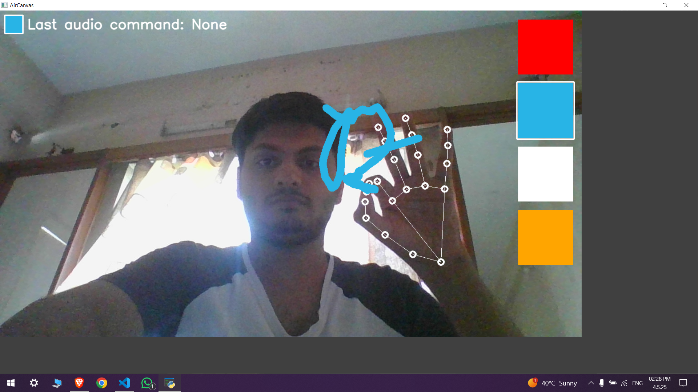
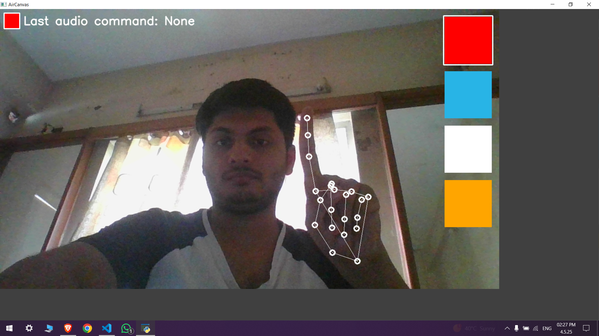
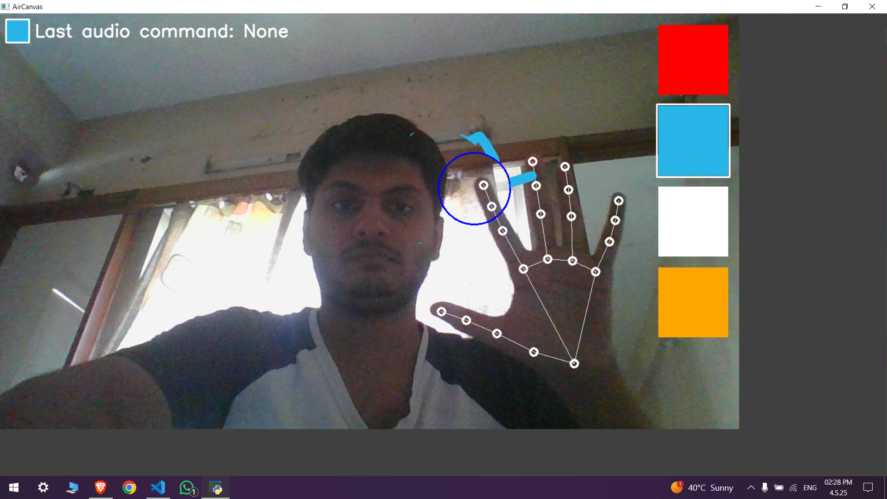

# Snapsense

**Snapsense** is an interactive computer vision experience that lets you draw mid-air using hand gestures. Imagine a hands-free MS Paint—powered by OpenCV and MediaPipe, where your hand becomes the brush and your webcam the gateway to creativity.

---

## 🧠 About

Snapsense turns your webcam into a gesture-powered drawing interface, allowing you to paint, erase, and select colors with intuitive hand movements. It brings together:

- 🎯 **MediaPipe** for high-precision hand tracking and gesture detection  
- 🎨 **OpenCV** to render strokes and interpret gestures  
- 🤖 Smart **Computer Vision** techniques to map movement into meaningful drawing commands  

This project explores how touchless, natural interaction can serve as a digital creative tool—blending art and AI.

---

## ⚙️ Installation

### Prerequisites

- Python 3.8 or higher  
- A functional webcam

### Setup

1. Clone the repository:
   ```
   git clone https://github.com/Programiz-007/SnapSense_Computer_Vision.git
   cd Snapsense
   ```

2. Create a virtual environment (recommended):
   ```
   # Using conda
   conda create -n snapsense python=3.8
   conda activate snapsense
   
   # Or using venv
   python -m venv snapsense
   source snapsense/bin/activate  # On Windows: snapsense\Scripts\activate
   ```

3. Install the required packages:
   ```
   pip install -r requirements.txt
   ```

4. Run the application:
   ```
   python src/main.py
   ```
## Usage


Snapsense recognises different hand gestures to control drawing functions:

### Drawing Gesture

Make a pinch gesture with your index finger and thumb to draw. Move your hand while maintaining the pinch to create lines and shapes.



### Select Gesture

Point with your index finger to select colors from the palette on the right side of the screen.




### Erase Gesture

Show an open palm to erase. A circle will appear around your index finger showing the eraser size.




### Controls and Features
- **Colour Palette**: Located on the right side of the screen
- **Current Colour**: Displayed in the top-left corner
- **Exit**: Press 'q' to quit the application

### Audio Recognition 

Snapsense includes an audio recognition feature that allows you to control the application using voice commands. This feature leverages the `speech_recognition` library to interpret spoken words and execute corresponding actions within the application.

### Supported Commands
- **"Clear"**: Clears the canvas.
- **"Exit"**: Closes the application.
- **"Blue", "Red", "Green", "Yellow", "White"**: Changes the drawing color to the specified color.

The audio recognition runs in a separate thread, allowing it to listen for commands continuously while you draw.
